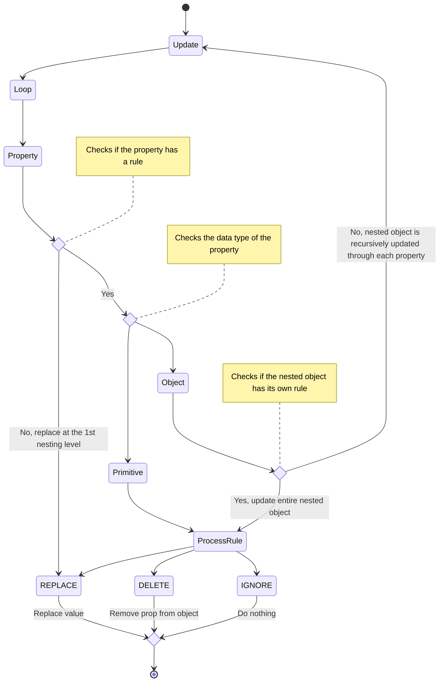

# Object Updater

## Table of contents
 
- [Object Updater](#object-updater)
  - [Table of contents](#table-of-contents)
  - [Definitions](#definitions)
  - [Design](#design)
    - [Update Rules](#update-rules)
    - [Update Process](#update-process)

## Definitions

TBD

## Design

### Update Rules

**General Rules**

- `REPLACE` - The target value will be replaced with new one
- `IGNORE` - The target value will not be changed
- `DELETE` - The the target property will be removed from the result object

**Additional Array Rules**

- `MERGE`: property is merged with the update (no check for duplicates).
- `UNION`: property is merged with the update, no duplicates.

### Update Process

